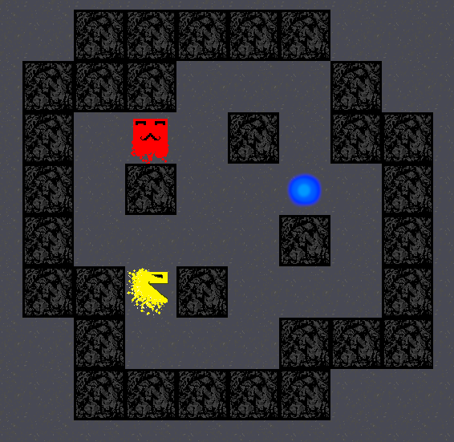

# Sokoban

Projet fait dans le contexte de l'UE Programmation avancée en semestre 2 de licence à l'UCA.

Le code est telle qu'il était lors de son rendu, avec toutes les imperfections et défaut de fonctionnalités qu'il présente.

Si vous êtes dans l'UE concernée à l'UCA passer votre chemin c'est votre premier projet conséquent en C, si vous pomper c'est pour galérer plus tard.

##Fonctionnalités

* Makefile disponible pour compilation et suppression des binaires.

* Affichage avec SDL(1.2)

* Gestion des input clavier

* Gestion basique du temps pour générer un score.

* Récupérations des niveaux depuis des fichiers text. 

##Requirement

* SDL 1.2
* libsdl-ttf 2.0
